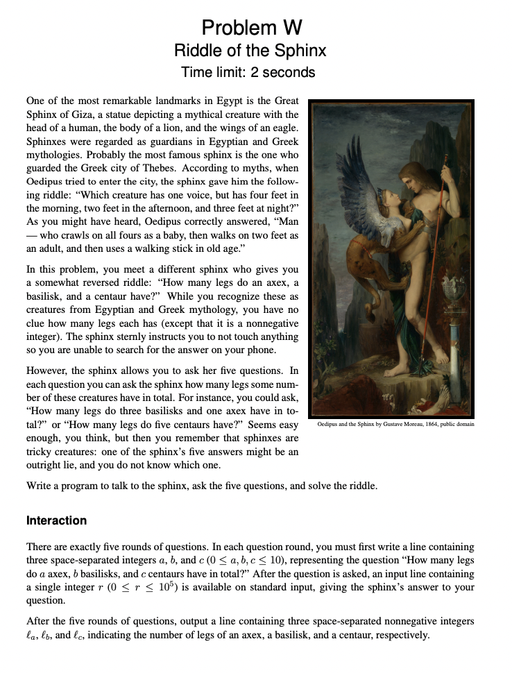
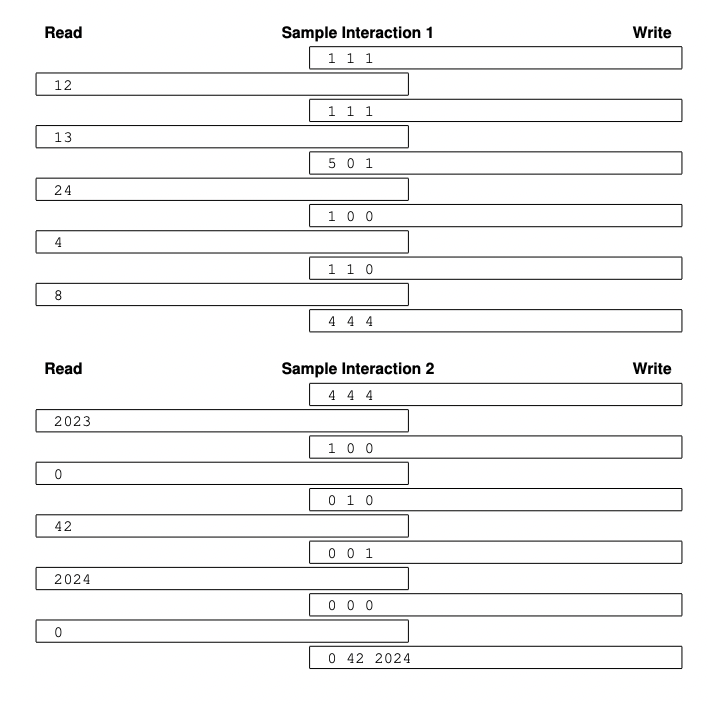

# Riddle of the Sphinx
## Problem W ICPC 2023

### Problem


### Sample Test Case


## Question Breakdown
The major goal of this question is to find answers to the following questions
1. How many legs do an axex have ?
2. How many legs do a basilisk have ?
3. How many legs do a centaur have ?
One thing that we know for sure is that there can be no negative values in the output of the code.
Here there is a creature to which you can ask a maximum of 5 questions. For each of the 5 questions asked the creature would provide an answer out of which one might be incorrect or a lie.

## Input Breakdown
Here the input "1 1 1" indicates "how many legs does 1 axex, 1 basilisk and 1 centaur have ?". We can ask the questions in 3 digits separated by space where each digit indicate the count of each animal.

## Code Snippet
```markdown
#include <iostream>
using namespace std;
int main()
{
    int a, b, c, d, e;
    cout << "1 0 0" << endl;
    cin >> a;
    cout << "0 1 0" << endl;
    cin >> b;
    cout << "0 0 1" << endl;
    cin >> c;
    cout << "1 1 1" << endl;
    cin >> d;
    cout << "1 2 3" << endl;
    cin >> e;
    if (a + b + c == d)
        cout << a << ' ' << b << ' ' << c << endl;
    else if (a + 2 * b + 3 * c == e)
        cout << a << ' ' << b << ' ' << c << endl;
    else if ((d - b - c) + 2 * b + 3 * c == e)
        cout << d - b - c << ' ' << b << ' ' << c << endl;
    else if (a + 2 * (d - c - a) + 3 * c == e)
        cout << a << ' ' << d - c - a << ' ' << c << endl;
    else
        cout << a << ' ' << b << ' ' << d - a - b << endl;
}
```
## Logic Explanation
In this above code I take 5 inputs:
1. How many legs does 1 axex have ?
2. How many legs does 1 basilisk have ?
3. How many legs does 1 centaur have ?
4. How many legs does 1 axex, 1 basilisk and 1 centaur have ?
5. How many legs does 1 axex, 2 basilisk and 3 centaur have ?

The first case is when a, b, c and d are true and e is a lie. In that case a + b + c is equal to d then the value of a, b and c would be true so print a, b, c.

The second case is when d is false but the rest is true. In that case a + 2 * b + 3 * c is equal to e then the value of a, b and c would be true so print a, b, c.

The third case is when the value of a is false but the rest is true. In that (d - b - c) would be the correct value of a. So (d - b - c) + 2 * b + 3 * c would be equal to e. Now print (d - b - c), b and c

The fourth case is when the value of b is false but the rest is true. In that (d - c - a) would be the correct value of b. So a + 2 * (d - c - a) + 3 * c equal to e. Now print a, (d - c - a) and c

The fifth case is when the value of c is false but the rest is true. In that d - a - b would be the correct value of c. So a + 2 * (d - c - a) + 3 * c would be equal to e. Now print a, b and (d - a - b)


