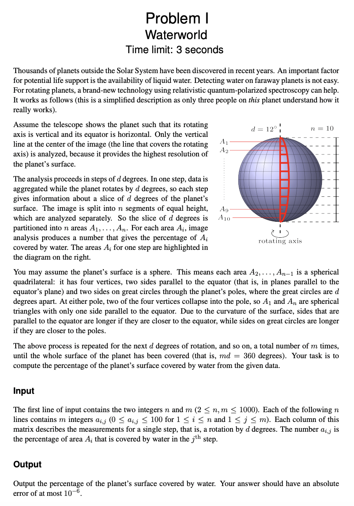
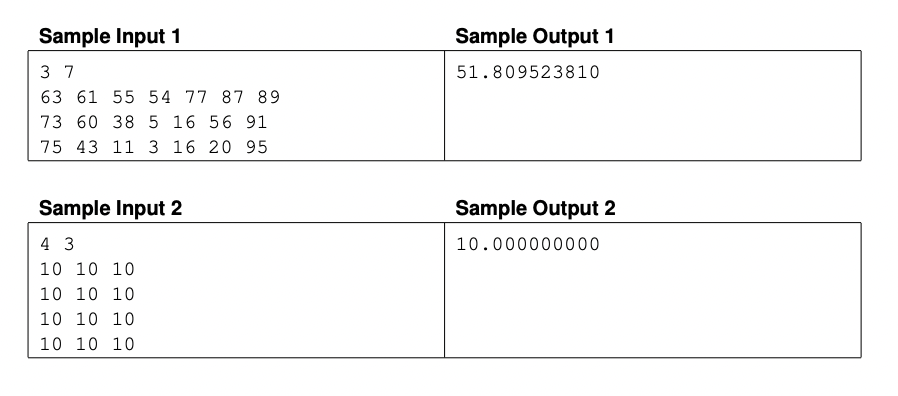

# Waterworld
## Problem I ICPC 2023

### Problem

### Sample Test Case

## Question Breakdown
The question uses a simplified version of the relativistic quantum-polarized spectroscopy approach. The major goal of the question is to find the percentage of water in the whole world. Here the world rotates about its vertical axis. The world is sliced horizontally into blocks. The number of blocks is given by the user. The world is spherical which rotates "d" degrees in each rotation. The degree of rotation is not given explicitly it is given in digits that is if the value is "7" then the degree of rotation is "51.42" (360/7). The area indicated in red denotes the the area segments when degree of rotation equals to "12". The percentage of water content for each segment will be provided by the user.

## Sample test case Breakdown

